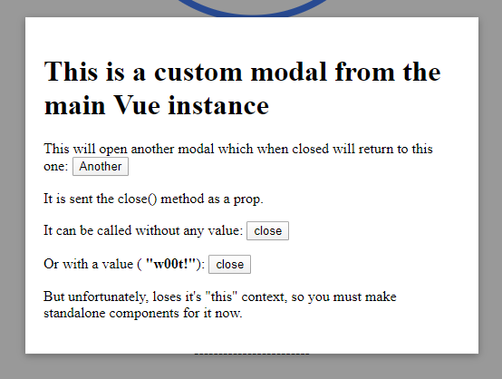
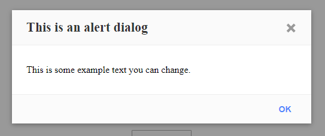
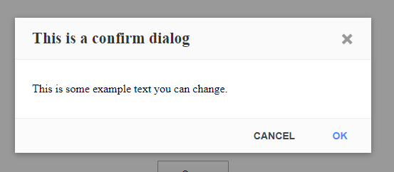
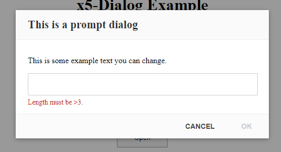

# x5 Dialog ([Live Demo](https://codesandbox.io/s/x5-dialog-example-jom3k?hidenavigation=1&view=preview))

This is a lightweight dialog plugin for Vue.

:warning: This plugin is in development, so please let me know if you find any errors.

## Installation

```bash
# npm
npm install x5-dialog --save
```

## Deployment

```js
import x5Dialog from 'x5-dialog'
Vue.use(x5Dialog)
```

## Usage

```js
this.$alert('This is an alert dialog.')
this.$confirm({ title: 'This is a confirm dialog.', text: 'It uses the options format to ste things like title.' })
```

## Options

### **`$modal` (options)** _(returns Promise)_



| Attribute |   Type   | Default | Description                                        |
| :-------- | :------: | :-----: | :------------------------------------------------- |
| onClose   | Function |   --    | Callback for when the message is closed            |
| overlay   | Boolean  | `true`  | Darken page behind background                      |
| permanent | Boolean  | `false` | Only allow closing the window via provided buttons |
| width     |  Number  |  `500`  | Maximum window width                               |
| class     |  String  |   --    | Extra classes for the window                       |
| style     |  String  |   --    | Extra styles for the window                        |

### **`$alert`, `$confirm`, `$prompt` (options)** _(returns Promise)_





:information_source: These attributes and options extend \$modal's (above)
| Attribute | Type | Default | Description |
| :--- | :---: | :---: | :--- |
| text | String | -- | Message text (required) |
| title | String | -- | Dialog header bar title |
| onClose | Function | -- | Callback for when the message is closed |
| onCancel | Function | -- | Callback for cancelling the Dialog |
| onOK | Function | -- | Callback for confirming the Dialog |
| labelOK | String | OK | OK button label |
| labelCancel | String | Cancel | Cancel button label |
| rules | Array | `[]` | Array of functions to test prompt input against |

## Contributing

Please read [CONTRIBUTING.md](./CONTRIBUTING.md) for the process for submitting pull requests.

## Authors

- **Keagan Chisnall** - [xon52](https://github.com/xon52)

## License

This project is licensed under the MIT License - see the [LICENSE.md](LICENSE.md) file for details

## Acknowledgments

**Inspired by:**

- The look and feel of [alertifyJS](https://alertifyjs.com/)
- The size and code of [vue-toast-notification](https://github.com/ankurk91/vue-toast-notification) by @ankurk91
