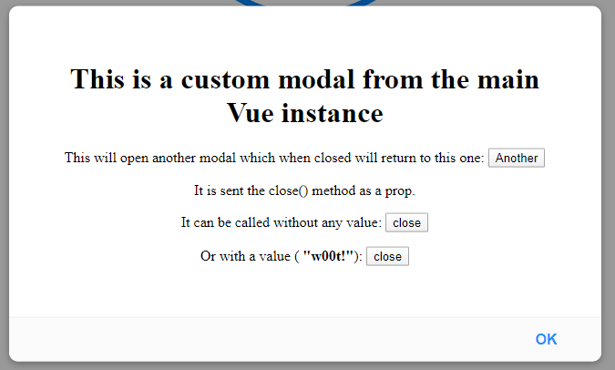

# x5 Dialog ([Live Demo](https://codesandbox.io/s/x5-dialog-example-jom3k?hidenavigation=1&view=preview))


This is a lightweight dialog plugin for Vue.

:warning: This plugin is in development, so please let me know if you find any errors.

## Installation

```bash
# npm
npm install x5-dialog
```

## Deployment

This plugin does require a [Vuex store](https://vuex.vuejs.org/) and can be installed like any Vue plugin in your entry
point:

```js
Vue.use(Vuex)
const store = new Vuex.Store()

import x5Dialog from 'x5-dialog'
Vue.use(x5Dialog, store)

new Vue({
  el: '#app',
  store: store,
  render: h => h(App),
})
```

This plugin uses a component to house all the magic, so it's recommended to put this near the end of your Vue app (e.g.
bottom of your App.vue template)

```html
<div id="app">
  ...
  <x5-dialog></x5-dialog>
</div>
```

| Attribute |  Type  | Default | Description              |
| :-------- | :----: | :-----: | :----------------------- |
| zIndex    | Number |  `200`  | z-index style for plugin |

<br>

# Usage

## Custom Modal - `this.$modal(component, options)`



```js
import CustomComponent from './CustomComponent.vue'

export default {
  methods: {
    open() {
      this.$modal(CustomComponent, { permanent: true })
    },
  },
}
```

| Option        |       Type       | Default | Description                                        |
| :------------ | :--------------: | :-----: | :------------------------------------------------- |
| buttons       |      String      |  'OK'   | Buttons to show (`OK`, `OKCancel`, `Cancel`)       |
| cancelDefault |       Any        | `false` | Promise default return value on cancel             |
| cancelText    |      String      | Cancel  | Cancel button label                                |
| data          |       Any        |  null   | Offers custom component prop 'data'                |
| okDefault     |       Any        | `true`  | Promise default return value on OK                 |
| okText        |      String      |   OK    | OK button label                                    |
| onCancel      | (async) Function |   --    | Callback for cancel                                |
| onClose       |     Function     |   --    | Callback for when the modal is closed              |
| onOK          | (async) Function |   --    | Callback for ok                                    |
| permanent     |     Boolean      | `false` | Only allow closing the window via provided buttons |
| title         |      String      |  null   | Modal header title (leave empty for no header)     |
| width         |      Number      |  `500`  | Maximum window width                               |

## Dialog - `this.$alert(text, options)`

  

```js
this.$alert('This is an alert dialog.')
this.$confirm('A confirm with a title.', { title: 'This is a confirm dialog.' })
```

:information_source: Prompt has one extra option to those above

| Option | Type  | Default | Description                                     |
| :----- | :---: | :-----: | :---------------------------------------------- |
| rules  | Array |  `[]`   | Array of functions to test prompt input against |

<br>

---

## Contributing

Please read [CONTRIBUTING.md](./CONTRIBUTING.md) for the process for submitting pull requests.

## Authors

- [Keagan Chisnall](https://github.com/xon52)

## License

This project is licensed under the MIT License - see the [LICENSE.md](LICENSE.md) file for details

## Acknowledgments

**Inspired by:**

- The look and feel of [alertifyJS](https://alertifyjs.com/)
- The size and code of [vue-toast-notification](https://github.com/ankurk91/vue-toast-notification) by @ankurk91
